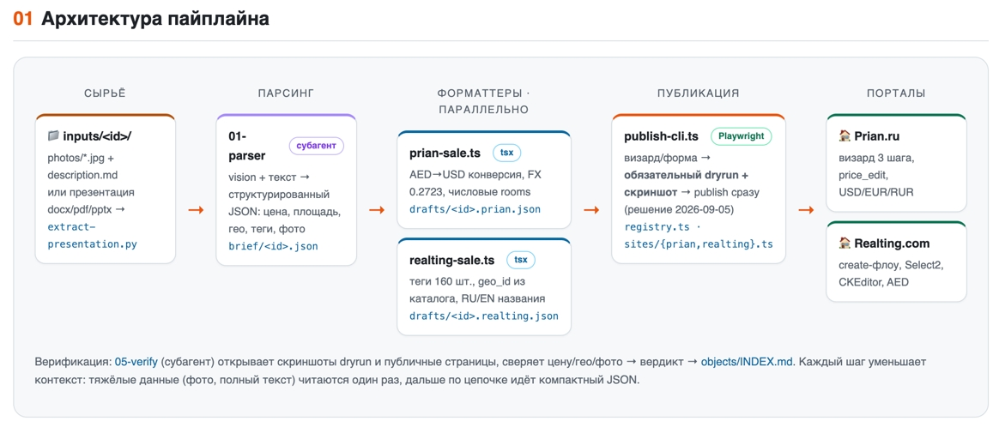

# 🏙️ Real Estate Posting Pipeline

**Автопостинг объектов недвижимости на порталы — за ~5 минут вместо часов ручной работы.**

Загружаете в систему фото и описание объекта — или целую презентацию застройщика (docx / pdf / pptx) — и получаете готовые, живые объявления, опубликованные сразу на всех порталах недвижимости. Без ручного заполнения форм. Без потери времени. Без расхождений в ценах.

---

## ⚡ Кому это нужно

- **Агентствам недвижимости**, которые регулярно выставляют объекты на порталы.
- **Девелоперам** с пакетными загрузками: новостройки, портфели из десятков юнитов, регулярные обновления каталога.
- **Брокерам ОАЭ / Турции / Испании**, где мультирегиональные порталы требуют валют, гео-справочников и двуязычных карточек.

Система спроектирована как конвейер: **добавление нового портала — это один adapter-файл и карта полей**, а не переписывание всего.

## 🎯 Что делает система

Агент даёт системе **один вход** — папку с фото и описанием или презентацию застройщика. Дальше конвейер работает сам:

1. **Парсинг** — LLM-агент с vision нарезает фото и текст из презентации, превращает сырьё в строгий JSON-бриф: цена, площадь, гео, теги, порядок фото.
2. **Форматтеры (параллельно)** — адаптируют бриф под поля каждого портала: конверсия валют (AED → USD по фиксированному курсу), числовые требования полей, локальные каталоги geo_id, RU/EN названия.
3. **Публикация** — Playwright под залогиненным аккаунтом заполняет формы: многошаговые визарды, Select2-виджеты, визуальные редакторы. Обязательный скриншот заполненной формы (dryrun) перед публикацией.
4. **Верификация** — отдельный агент-проверщик сверяет результат по чек-листу: цена, валюта, гео, главное фото, количество фотографий. Скриншоты и публичные страницы → вердикт.

## 📈 Эффект в цифрах

| Метрика | Результат |
|---|---|
| ⏱ Время на объект | **≈5 минут** вместо 40+ минут вручную на *каждый* портал |
| 📄 1 презентация | **→ 8 карточек**: ЖК с 4 типами юнитов разбивается на отдельные объявления автоматически |
| 🌐 Порталы | **Все сразу** — один прогон, единый бриф, ноль расхождений в ценах и описаниях |
| 💱 Опечатки в цене и валюте | **0** — конверсия AED→USD по фиксированному курсу + гейт-проверки |

## 🛠 Технологии

TypeScript · Claude Agent SDK (субагенты opus / sonnet / haiku) · Playwright (Chromium) · Vision-парсинг презентаций (docx / pdf / pptx) · macOS Keychain · JSON-контракты между этапами

---

### 🚀 Хотите такую же систему под свои порталы?

Проект собран под конкретные порталы (Prian.ru, Realting.com), но архитектура универсальна: новый портал подключается одним adapter-файлом и картой полей. Если вы агентство или девелопер и тонете в ручной публикации — такую систему можно собрать под ваш список порталов и ваш поток документов.

**Напишите мне — обсудим ваш пайплайн.**
